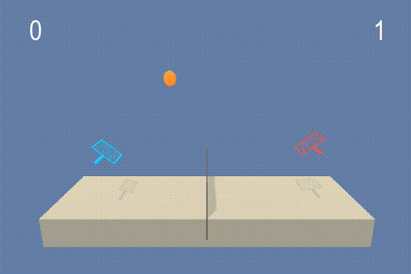

# Report
## Project 2 - Continuous Control
### Udacity Deep Reinforcement Learning Nanodegree
by Kitson Swann

## Reacher Environment

In this environment, our goal is to use a Deep Reinforcement Learning Agent to train a double-jointed arm to 
move its hand to a target location.

For the purpose of this assignment, the task is considered solved when the agent achieves a score of +30 
over 100 consecutive episodes.

### States

The state space contains 33 dimensions corresponding to: 

- position rotation  
- velocity
- angular velocities of the arm 

### Actions

Each action is a vector with four numbers, corresponding to torque 
applicable to two joints. Every entry in the action vector should 
be a number between -1 and 1. 

### Rewards

According to the project instructions a reward of +0.1 is provided for each step that the agent's hand is in the goal location. However, in practice the rewards are variable and never seem to go above +0.039. I am curious if the environment was updated between the time this assignment was authored and now. The different reward structure did not prevent me from succeeding at the task, but I wonder if it made it more difficult.

## Agent Version 1

For this project I had planned to initially begin with the simple single agent environment and move onto the more complex multi-agent environment after solving the simple one, but achieving the minimum average score on the single agent version proved quite difficult, so I stopped at solving just the simple environment. Below you can see the agent initialized with the state and action spaces shown.


```python
from unityagents import UnityEnvironment
import matplotlib.pyplot as plt
from optimize import find_optimal_hyperparameters
from train import train_ddpg

%matplotlib inline

env = UnityEnvironment(file_name='./env/v1/Reacher.app')

# get the default brain
brain_name = env.brain_names[0]
brain = env.brains[brain_name]

# reset the environment
env_info = env.reset(train_mode=True)[brain_name]

# number of agents
num_agents = len(env_info.agents)
print('Number of agents:', num_agents)

# size of each action
action_size = brain.vector_action_space_size
print('Size of each action:', action_size)

# examine the state space 
states = env_info.vector_observations
state_size = states.shape[1]
print('There are {} agents. Each observes a state with length: {}'.format(states.shape[0], state_size))
print('The state for the first agent looks like:', states[0])
```

    INFO:unityagents:
    'Academy' started successfully!
    Unity Academy name: Academy
            Number of Brains: 1
            Number of External Brains : 1
            Lesson number : 0
            Reset Parameters :
    		goal_speed -> 1.0
    		goal_size -> 5.0
    Unity brain name: ReacherBrain
            Number of Visual Observations (per agent): 0
            Vector Observation space type: continuous
            Vector Observation space size (per agent): 33
            Number of stacked Vector Observation: 1
            Vector Action space type: continuous
            Vector Action space size (per agent): 4
            Vector Action descriptions: , , , 


    Number of agents: 1
    Size of each action: 4
    There are 1 agents. Each observes a state with length: 33
    The state for the first agent looks like: [ 0.00000000e+00 -4.00000000e+00  0.00000000e+00  1.00000000e+00
     -0.00000000e+00 -0.00000000e+00 -4.37113883e-08  0.00000000e+00
      0.00000000e+00  0.00000000e+00  0.00000000e+00  0.00000000e+00
      0.00000000e+00  0.00000000e+00 -1.00000000e+01  0.00000000e+00
      1.00000000e+00 -0.00000000e+00 -0.00000000e+00 -4.37113883e-08
      0.00000000e+00  0.00000000e+00  0.00000000e+00  0.00000000e+00
      0.00000000e+00  0.00000000e+00  5.75471878e+00 -1.00000000e+00
      5.55726671e+00  0.00000000e+00  1.00000000e+00  0.00000000e+00
     -1.68164849e-01]


## Solution

### Algorithm

As suggested in the project instructions I used the Deep Deterministic Policy Gradient agent from the Pendulum environment example [here](https://github.com/udacity/deep-reinforcement-learning/tree/master/ddpg-pendulum) as a starting point. I modified the training loop to work with the Unity Reacher environment, which required some minor changes from the original which was based on an OpenAI Gym environment.

The Deep Deterministic Policy Gradient (DDPG) algorithm is similar to a Deep Q Network (DQN) but adapted and modified to suit the task of solving environments with continuous action spaces.

The DDPG algorithm is similar to a DQN in that:
- It uses a replay buffer to store experience tuples which it samples mini-batches from to perform gradient descent steps on the network. 
- It also makes use of local and a target networks to make target values more stationary while training.

However, DQN estimates a Q function that outputs a value for each possible discrete action. Then the agent greedily chooses the action with the highest value. The DDPG instead includes:
- an actor - which is a deterministic policy network that takes in a state and returns an action to take directly and,
- a critic - a value network which takes in the state plus the action from the actor, and returns the value of the state/action pair

In the learning step in DDPG:

- A minibatch is sampled from the replay buffer
- The target actor network predicts the next actions from the states
- The target critic predicts the values of the chosen actions
- The Q targets are calculated
- The Q expected values are calculated using the local critic
- The critic loss is calculated between the expected and target Q values
- The loss is minimized on the local critic network
- The local actor network predicts the next actions
- The actor loss is calculated using the local critic
- The loss is minimized on the local actor network
- The actor and critic target networks are soft updated with the local network parameters

### Initial Experimentation

After getting the training routine working, I initially had no success in getting the agent to train with the standard hyper-parameters. The score was oscillating around 0-0.1 most of the time and not improving even over 100 episodes.

Normally at this point I would have experimented with hyperparameter-optimization, but in this algorithm there are so many parameters that I felt the need to look for some good values. I consulted Udacity's Knowledge Base for some assistance, and saw a number of suggestions. I reviewed the suggestions and many repositories containing the solutions of other students for ideas. I made a number of changes as a result including:

- Changing the training loop to end when done which for the Reacher environment is 1000 timesteps.
- Trying different random seeds.
- Modified the architecture of the actor and critic neural networks to try different hidden layer sizes.
- Modified the architecture of the actor and critic neural networks to add batch normalization.
- Modified the DDPG agent to only do a learning step every 5, 10, 20, 40 iterations.
- Reset the noise after every episode.
- Tried different suggested values for buffer size, batch size, gamma, tau, weight decay and the sigma variable in the Ornstein-Uhlenbeck process noise implementation.

Even with all of the above modifications I still wasn't seeing any decent results. The score rarely went above 0.5, and seemed to get worse over time.

### Structured Hyper-parameter Optimization

After seeing a number of people say the suggested changes should work, but having no success myself, I felt that I needed to take a more robust approach to hyper-parameter optimization. Similar to my implementation in Project 1, I used scikit-optimize's Gaussian Process Optimizer to search for a better set of hyper-parameters. Below is the search space that I initially defined.

I initially did batches of 10 episodes to keep the run time short and look for some better initial values. Because the process takes a long time I watched the values from each run, and visually tried to understand what values of each parameter were working well. As I noticed good values, I iteratively removed parameters from the search space, instead setting them at reasonable levels until I found something that worked fairly well which I've called Reasonable Parameter Set below.

I have included the call to the optimization routine below, but haven't run it as it takes up a lot of space, and I re-ran it iteratively so one single output was never the final one used.


```python
from skopt.space import Real, Integer, Categorical

space = [
    Real(0, 0.5, "uniform", name='eps_end'),
    Real(1e-5, 1e0, "log-uniform", name='eps_decay'),
    Categorical([1e5, 1e6], name="buffer_size"),
    Categorical([64, 128, 256, 512], name="batch_size"),
    Categorical([1, 5, 10, 20, 40], name="update_every"),
    Categorical([1, 5, 10, 20], name="update_times"),
    Categorical([128, 256, 512], name="actor_fc1_units"),
    Categorical([128, 256, 512], name="actor_fc2_units"),
    Categorical([128, 256, 512], name="critic_fc1_units"),
    Categorical([128, 256, 512], name="critic_fc2_units"),
    Real(1e-5, 1e-3, "log-uniform", name='actor_lr'),
    Real(1e-5, 1e-3, "log-uniform", name='critic_lr'),
    Real(0.9, 0.99, "uniform", name="gamma"),
    Real(1e-2, 1e-1, "log-uniform", name="tau"),
    Real(0, 1e-3, "uniform", name="weight_decay"),
    Real(0.01, 0.05, "log-uniform", name="noise_theta"),
    Real(0.01, 0.05, "log-uniform", name="noise_sigma"),
]

params, res_gp = find_optimal_hyperparameters(env=env, brain_name=brain_name, num_agents=num_agents, n_calls=50, episodes_per_batch=10, space=space)
```

#### Reasonable Parameter Set

This is the best resonable parameter set I found through a somewhat manual search for hyper-parameters. There are many parameters to tune here, and the search space grows so quickly that a full optimization run was going to take more time than I had available, so I viewed the results and manually tuned based on what I saw to develop the set of values below.


```python
optimal_params = {
  "random_seed": 22,
  "noise_sigma": 0.02,
  "noise_theta": 0.015,
  "weight_decay": 0,
  "tau": 0.05,
  "gamma": 0.95,
  "critic_lr": 0.0001,
  "actor_lr": 0.001,
  "critic_fc2_units": 128,
  "critic_fc1_units": 128,
  "actor_fc2_units": 128,
  "actor_fc1_units": 128,
  "update_times": 10,
  "update_every": 20,
  "batch_size": 256,
  "buffer_size": 1000000.0,
  "eps_decay": 0.7,
  "eps_end": 0.3,
  "eps_start": 1.0,
  "action_size": 4,
  "state_size": 33,
  "n_episodes": 2000,
  "solved_threshold": 31.0,
  "break_early": True,
  "name": "_optimal",
  "num_agents": 1,
  "brain_name": "ReacherBrain"
}

scores = train_ddpg(env=env, **optimal_params)
```

    {
      "random_seed": 22,
      "noise_sigma": 0.02,
      "noise_theta": 0.015,
      "weight_decay": 0,
      "tau": 0.05,
      "gamma": 0.95,
      "critic_lr": 0.0001,
      "actor_lr": 0.001,
      "critic_fc2_units": 128,
      "critic_fc1_units": 128,
      "actor_fc2_units": 128,
      "actor_fc1_units": 128,
      "update_times": 10,
      "update_every": 20,
      "batch_size": 256,
      "buffer_size": 1000000.0,
      "eps_decay": 0.7,
      "eps_end": 0.3,
      "eps_start": 1.0,
      "action_size": 4,
      "state_size": 33,
      "n_episodes": 2000,
      "solved_threshold": 31.0,
      "break_early": true,
      "name": "_optimal",
      "num_agents": 1,
      "brain_name": "ReacherBrain"
    Replay Buffer Size: 1000000.0, Batch Size: 256


    /Users/kitson_swann/Documents/udacity_drl/udacity_drl_p2/src/ddpg_agent.py:140: UserWarning: torch.nn.utils.clip_grad_norm is now deprecated in favor of torch.nn.utils.clip_grad_norm_.
      torch.nn.utils.clip_grad_norm(self.critic_local.parameters(), 1)


    Episode 100	Average Score: 1.69
    Episode 200	Average Score: 7.48
    Episode 300	Average Score: 13.16
    Episode 400	Average Score: 16.45
    Episode 500	Average Score: 23.23
    Episode 600	Average Score: 29.82
    Episode 639	Average Score: 31.07
    Environment solved in 639 episodes!	Average Score: 31.07


```python
import json

with open("scores.json", "w") as f:
    json.dump({"scores": scores}, f, indent=2)
```

### Success !!!

As you can see above the environment was solved in 639 episodes. In reality, it was a bit shorter than that, because I set the threshold to 31 just to go a bit beyond the minimim value.

Below you can see the plots of raw scores and average scores that I took from Tensorboard.


## Watch The Trained Agent

Below I've loaded the trained agent and shown a gif of it performing the task.


```python
from unityagents import UnityEnvironment
env = UnityEnvironment(file_name='./env/v1/Reacher.app')

# get the default brain
brain_name = env.brain_names[0]
brain = env.brains[brain_name]
from ddpg_agent import Agent
import torch
import numpy as np

params = {
  "random_seed": 2,
  "noise_sigma": 0.02,
  "noise_theta": 0.015,
  "weight_decay": 0,
  "tau": 0.05,
  "gamma": 0.95,
  "critic_lr": 0.0001,
  "actor_lr": 0.001,
  "critic_fc2_units": 128,
  "critic_fc1_units": 128,
  "actor_fc2_units": 128,
  "actor_fc1_units": 128,
  "update_times": 10,
  "update_every": 20,
  "batch_size": 256,
  "buffer_size": 1000000.0,
  "eps_decay": 0.7,
  "eps_end": 0.3,
  "eps_start": 1.0,
  "action_size": 4,
  "state_size": 33
}

agent = Agent(**params)

agent.actor_local.load_state_dict(torch.load('checkpoint_actor_optimal.pth'))
agent.critic_local.load_state_dict(torch.load('checkpoint_critic_optimal.pth'))
        
env_info = env.reset(train_mode=False)[brain_name]
agent.reset()
states = env_info.vector_observations
agent_scores = []
i = 1
while True:
    print(f"Timestep: {i}", end = "\r")
    actions = agent.act(state=states, add_noise=True)
    env_info = env.step(actions)[brain_name]
    next_states = env_info.vector_observations
    rewards = env_info.rewards
    dones = env_info.local_done
    states = next_states
    agent_scores.append(rewards[0])
    print(f"Timestep: {i}, Reward: {round(rewards[0],4)}, Mean: {round(np.mean(agent_scores),4)}", end = "\r")
    agent_scores
    if np.any(dones):
        break
    i += 1

env.close()
```

    INFO:unityagents:
    'Academy' started successfully!
    Unity Academy name: Academy
            Number of Brains: 1
            Number of External Brains : 1
            Lesson number : 0
            Reset Parameters :
    		goal_speed -> 1.0
    		goal_size -> 5.0
    Unity brain name: ReacherBrain
            Number of Visual Observations (per agent): 0
            Vector Observation space type: continuous
            Vector Observation space size (per agent): 33
            Number of stacked Vector Observation: 1
            Vector Action space type: continuous
            Vector Action space size (per agent): 4
            Vector Action descriptions: , , , 


    Replay Buffer Size: 1000000.0, Batch Size: 256
    Timestep: 1001, Reward: 0.04, Mean: 0.0358



## Longer Training Run with Larger Network

I wanted to see how much better the score could get with a slightly longer training run and networks with larger hidden layers. I also modified the batch size since it seems to have an effect on how long each iteration takes.

Below you can see that performance improved slightly breaking the previous score, but it seemed to be hitting a plateau just above 30, so I terminated it.

After understanding that there are always 1000 time steps in an episode, and the rewards are closer to 0.04 rather than 0.10 as per timestep that the arm is touching the goal, I realized there is an upper limit on the score of 0.40 * 1000 = 40. I think this is why the agent plateues just after a score of 30, because it is getting closer and closer to a perfect performance.


```python
alternate_params = {
  "random_seed": 22,
  "noise_sigma": 0.02,
  "noise_theta": 0.015,
  "weight_decay": 0,
  "tau": 0.05,
  "gamma": 0.95,
  "critic_lr": 0.0001,
  "actor_lr": 0.001,
  "critic_fc2_units": 300,
  "critic_fc1_units": 400,
  "actor_fc2_units": 300,
  "actor_fc1_units": 400,
  "update_times": 10,
  "update_every": 20,
  "batch_size": 256,
  "buffer_size": 500000.0,
  "eps_decay": 0.7,
  "eps_end": 0.3,
  "eps_start": 1.0,
  "action_size": 4,
  "state_size": 33,
  "n_episodes": 5000,
  "solved_threshold": 31.0,
  "break_early": False,
  "name": "_alternate",
  "num_agents": 1,
  "brain_name": "ReacherBrain"
}

scores = train_ddpg(env=env, **alternate_params)
```

    {
      "random_seed": 22,
      "noise_sigma": 0.02,
      "noise_theta": 0.015,
      "weight_decay": 0,
      "tau": 0.05,
      "gamma": 0.95,
      "critic_lr": 0.0001,
      "actor_lr": 0.001,
      "critic_fc2_units": 300,
      "critic_fc1_units": 400,
      "actor_fc2_units": 300,
      "actor_fc1_units": 400,
      "update_times": 10,
      "update_every": 20,
      "batch_size": 256,
      "buffer_size": 500000.0,
      "eps_decay": 0.7,
      "eps_end": 0.3,
      "eps_start": 1.0,
      "action_size": 4,
      "state_size": 33,
      "n_episodes": 5000,
      "solved_threshold": 31.0,
      "break_early": false,
      "name": "_alternate",
      "num_agents": 1,
      "brain_name": "ReacherBrain"
    Replay Buffer Size: 500000.0, Batch Size: 256


    /Users/kitson_swann/Documents/udacity_drl/udacity_drl_p2/src/ddpg_agent.py:140: UserWarning: torch.nn.utils.clip_grad_norm is now deprecated in favor of torch.nn.utils.clip_grad_norm_.
      torch.nn.utils.clip_grad_norm(self.critic_local.parameters(), 1)


    Episode 100	Average Score: 2.96
    Episode 200	Average Score: 14.06
    Episode 300	Average Score: 27.03
    Episode 343	Average Score: 31.07
    Environment solved in 343 episodes!	Average Score: 31.07
    Episode 344	Average Score: 31.02
    Environment solved in 344 episodes!	Average Score: 31.02
    Episode 345	Average Score: 31.15
    Environment solved in 345 episodes!	Average Score: 31.15
    Episode 346	Average Score: 31.20
    Environment solved in 346 episodes!	Average Score: 31.2
    Episode 347	Average Score: 31.20
    Environment solved in 347 episodes!	Average Score: 31.2
    Episode 348	Average Score: 31.24
    Environment solved in 348 episodes!	Average Score: 31.24
    Episode 349	Average Score: 31.31
    Environment solved in 349 episodes!	Average Score: 31.31
    Episode 350	Average Score: 31.29
    Environment solved in 350 episodes!	Average Score: 31.29
    Episode 351	Average Score: 31.34
    Environment solved in 351 episodes!	Average Score: 31.34
    Episode 352	Average Score: 31.43
    Environment solved in 352 episodes!	Average Score: 31.43
    Episode 353	Average Score: 31.51
    Environment solved in 353 episodes!	Average Score: 31.51
    Episode 354	Average Score: 31.56
    Environment solved in 354 episodes!	Average Score: 31.56
    Episode 355	Average Score: 31.55
    Environment solved in 355 episodes!	Average Score: 31.55
    Episode 356	Average Score: 31.62
    Environment solved in 356 episodes!	Average Score: 31.62
    Episode 357	Average Score: 31.66
    Environment solved in 357 episodes!	Average Score: 31.66
    Episode 358	Average Score: 31.67
    Environment solved in 358 episodes!	Average Score: 31.67
    Episode 359	Average Score: 31.68
    Environment solved in 359 episodes!	Average Score: 31.68
    Episode 360	Average Score: 31.79
    Environment solved in 360 episodes!	Average Score: 31.79
    Episode 361	Average Score: 31.79
    Environment solved in 361 episodes!	Average Score: 31.79
    Episode 362	Average Score: 31.88
    Environment solved in 362 episodes!	Average Score: 31.88
    Episode 363	Average Score: 31.97
    Environment solved in 363 episodes!	Average Score: 31.97
    Episode 364	Average Score: 31.95
    Environment solved in 364 episodes!	Average Score: 31.95
    Episode 365	Average Score: 32.05
    Environment solved in 365 episodes!	Average Score: 32.05
    Episode 366	Average Score: 32.07
    Environment solved in 366 episodes!	Average Score: 32.07
    Episode 367	Average Score: 32.06
    Environment solved in 367 episodes!	Average Score: 32.06
    Episode 368	Average Score: 32.18
    Environment solved in 368 episodes!	Average Score: 32.18
    Episode 369	Average Score: 32.13
    Environment solved in 369 episodes!	Average Score: 32.13
    Episode 370	Average Score: 32.19
    Environment solved in 370 episodes!	Average Score: 32.19
    Episode 371	Average Score: 32.32
    Environment solved in 371 episodes!	Average Score: 32.32
    Episode 372	Average Score: 32.30
    Environment solved in 372 episodes!	Average Score: 32.3
    Episode 373	Average Score: 32.39
    Environment solved in 373 episodes!	Average Score: 32.39
    Episode 374	Average Score: 32.45
    Environment solved in 374 episodes!	Average Score: 32.45
    Episode 375	Average Score: 32.49
    Environment solved in 375 episodes!	Average Score: 32.49
    Episode 376	Average Score: 32.52
    Environment solved in 376 episodes!	Average Score: 32.52
    Episode 377	Average Score: 32.57
    Environment solved in 377 episodes!	Average Score: 32.57
    Episode 378	Average Score: 32.66
    Environment solved in 378 episodes!	Average Score: 32.66
    Episode 379	Average Score: 32.69
    Environment solved in 379 episodes!	Average Score: 32.69
    Episode 380	Average Score: 32.72
    Environment solved in 380 episodes!	Average Score: 32.72
    Episode 381	Average Score: 32.72
    Environment solved in 381 episodes!	Average Score: 32.72
    Episode 382	Average Score: 32.69
    Environment solved in 382 episodes!	Average Score: 32.69
    Episode 383	Average Score: 32.67
    Environment solved in 383 episodes!	Average Score: 32.67
    Episode 384	Average Score: 32.70
    Environment solved in 384 episodes!	Average Score: 32.7
    Episode 385	Average Score: 32.72
    Environment solved in 385 episodes!	Average Score: 32.72
    Episode 386	Average Score: 32.80
    Environment solved in 386 episodes!	Average Score: 32.8
    Episode 387	Average Score: 32.85
    Environment solved in 387 episodes!	Average Score: 32.85
    Episode 388	Average Score: 32.93
    Environment solved in 388 episodes!	Average Score: 32.93
    Episode 389	Average Score: 33.02
    Environment solved in 389 episodes!	Average Score: 33.02
    Episode 390	Average Score: 33.08
    Environment solved in 390 episodes!	Average Score: 33.08
    Episode 391	Average Score: 33.14
    Environment solved in 391 episodes!	Average Score: 33.14
    Episode 392	Average Score: 33.24
    Environment solved in 392 episodes!	Average Score: 33.24
    Episode 393	Average Score: 33.23
    Environment solved in 393 episodes!	Average Score: 33.23
    Episode 394	Average Score: 33.26
    Environment solved in 394 episodes!	Average Score: 33.26
    Episode 395	Average Score: 33.27
    Environment solved in 395 episodes!	Average Score: 33.27
    Episode 396	Average Score: 33.23
    Environment solved in 396 episodes!	Average Score: 33.23


    ---------------------------------------------------------------------------

    KeyboardInterrupt                         Traceback (most recent call last)

    <ipython-input-2-66924f3da8ca> in <module>
         29 }
         30 
    ---> 31 scores = train_ddpg(env=env, **alternate_params)
    

    ~/Documents/udacity_drl/udacity_drl_p2/src/train.py in train_ddpg(env, brain_name, num_agents, name, break_early, solved_threshold, n_episodes, state_size, action_size, eps_start, eps_end, eps_decay, buffer_size, batch_size, update_every, update_times, actor_fc1_units, actor_fc2_units, critic_fc1_units, critic_fc2_units, actor_lr, critic_lr, gamma, tau, weight_decay, noise_theta, noise_sigma, random_seed)
        128 
        129             for (state, action, reward, next_state, done) in zip(states, actions, rewards, next_states, dones):
    --> 130                 agent.step(state, action, reward, next_state, done)
        131 
        132             states = next_states


    ~/Documents/udacity_drl/udacity_drl_p2/src/ddpg_agent.py in step(self, state, action, reward, next_state, done)
         90         if len(self.memory) > self.batch_size and self.t_step == 0:
         91             for i in range(self.update_times):
    ---> 92                 experiences = self.memory.sample()
         93                 self.learn(experiences, self.gamma)
         94 


    ~/Documents/udacity_drl/udacity_drl_p2/src/ddpg_agent.py in sample(self)
        213     def sample(self):
        214         """Randomly sample a batch of experiences from memory."""
    --> 215         experiences = random.sample(self.memory, k=self.batch_size)
        216 
        217         states = torch.from_numpy(np.vstack([e.state for e in experiences if e is not None])).float().to(device)


    ~/opt/anaconda3/envs/udacity_drl_p2/lib/python3.6/random.py in sample(self, population, k)
        338                     j = randbelow(n)
        339                 selected_add(j)
    --> 340                 result[i] = population[j]
        341         return result
        342 


    KeyboardInterrupt: 


# Ideas for Future Work

If I had more time and access to a GPU I could conduct a more exhaustive hyper-parameter search, letting the agent run for at least 100 episodes each time and I would probably find a better set of parameters, but I don't think this would lead to a significantly better solution for the reason I mentioned above that there isan upper limit on performance. It may lead to a faster to train and more efficient solution though.

Using the same algorithm, I could also make slight modifications to train with the multi-agent version of the Reacher environment. I did try this but didn't see initially better performance and it seemed that the hyper-parameters were more important. Now that I've found some decent options I could further investigate the multi-agent version.

In the project instructions, there were also number of other algorithms mentioned that may work better including:

- Trust Region Policy Optimization (TRPO)
- Truncated Natural Policy Gradient (TNPG)
- Proximal Policy Optimization (PPO)
- Distributed Distributional Deterministic Policy Gradients (D4PG)

The next steps for me would be to investigate and attempt to solve the task with one or more of these alternate algorithms.
